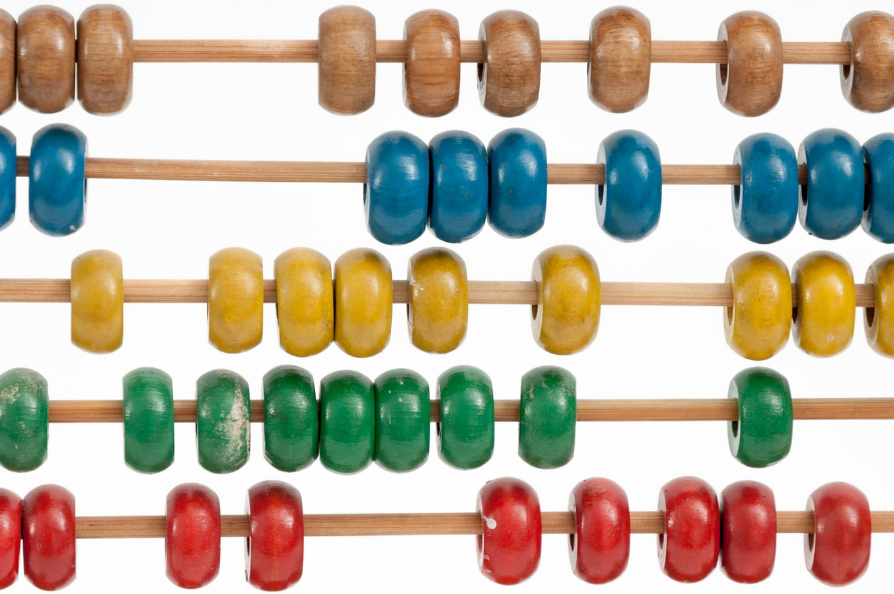
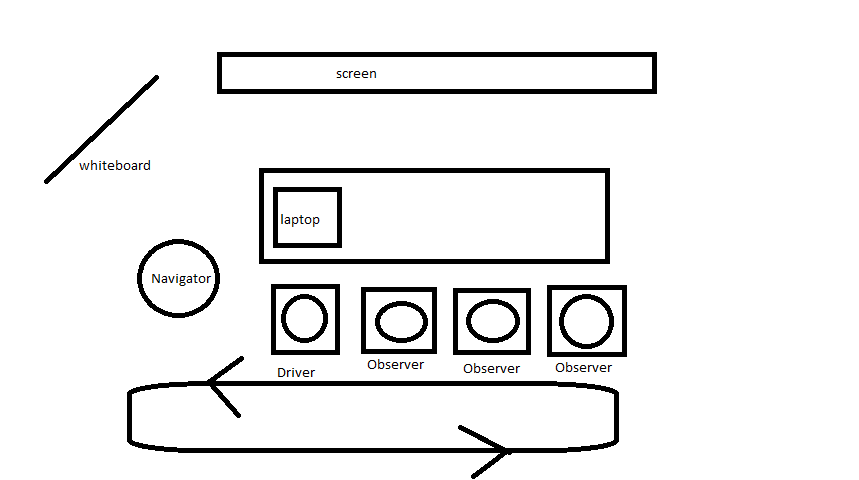

# Roman Numerals Addition

## Description

The main intent of this kata is to practice Mob Programming.

For this we will run a variant of the Roman Numerals Converter kata, where 
we intend this time to calculate the sum of 2 roman numbers.

To add a bit of fun, we will do it without any use of integers._

### A Few Examples

| Num 1 | + | Num 2 | = | Sum |
| --- | --- | --- | --- | --- |
| I | + | I | = | II |
| IV | + | X | = | XIV |
| XCIX | + | I | = | C |
| CXXIV | + | MDCCCXCV | = | MMXIX |

### Kata Organisation & Rules

| Step | Description |
| --- | --- |
| 1    | A bit of theory<ul><li>driver and navigator</li><li>strong style pairing</li><li>driver as smart input device</li><li>silent driver</li><li>never comment, delete or ignore passing test</li></ul> |
| 2    | Start by practicing 4 minutes turning (even for C++, 4 minutes are ok) <ul><li>navigator standing</li><li>raise hands</li><li>turn</li></ul> |
| 3    | [Mini Retro](./MiniRetro.md) |
| 4    | Dojo with silent observers and driver |
| 5    | [Mini Retro](./MiniRetro.md) |
| 6    | Dojo with observers allowed to speak, one at a time, after they raise their hands |
| 7    | [Mini Retro](./MiniRetro.md) |
| 8    | Dojo without observers, only navigators, one speaks at a time |
| 9    | [Mini Retro](./MiniRetro.md) |

## Session Quick Retrospective

You can fill it from [here](./QuickRetrospective.md)

## Useful Links

### For this Kata

- [Mob Programming Basics](https://mobprogramming.org/mob-programming-basics/)
- [Strong-Style Pairing](http://llewellynfalco.blogspot.com/2014/06/llewellyns-strong-style-pairing.html)
- [A video introducing Mob Programming](https://www.agilealliance.org/resources/sessions/mob-programming-aatc2017/) by Woody Zuill
- Some useful tips for [Remote Mob Programming](https://www.remotemobprogramming.org/)
- [Online roman decimal converter](https://www.calculateme.com/roman-numerals/to-roman)
- [Another one](https://www.calculator.org/calculate-online/mathematics/roman-numerals.html)
- [One more](https://goodcalculators.com/roman-numeral-converter/)

### General

- Handy for any type of turn-based session: [Online Timer](https://agility.jahed.dev/)

## Session Information

### Style & Duration

- 2-hour [Mob Kata](./doc/MobProgramming.md)

### Topic

Mob Programming kata

### Focus Points

- Mob refactoring
- Teamwork
- Strong Style pairing
- Collective design

### Source Files

